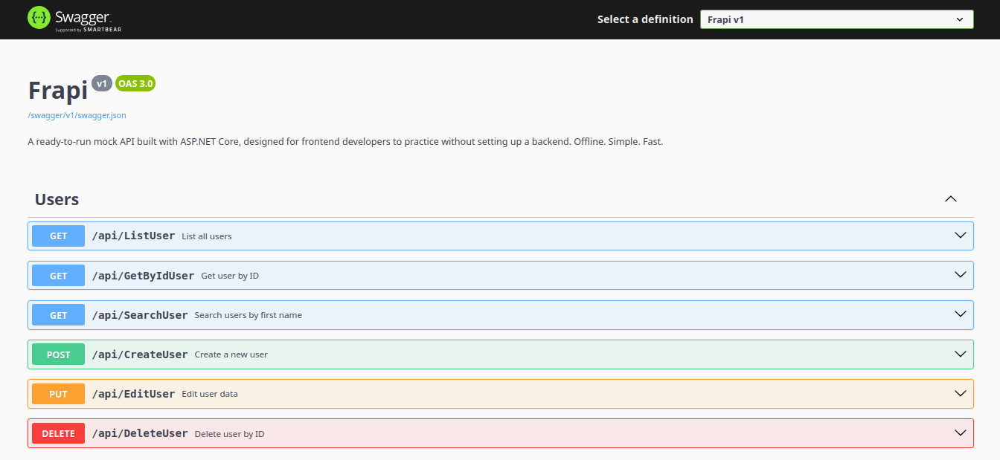

# Frapi

A ready-to-run mock API built with **ASP.NET Core**, designed for frontend developers to practice without setting up a backend.  
**Offline. Simple. Fast.**

Ideal for those using React, Angular, Flutter, Blazor, etc.

---

## 🎯 Objective

**Frapi** was created for frontend developers who:

- Don’t want to waste time creating a backend
- Want to practice CRUD and data consumption
- Need something 100% offline
- Want consistent data available on every run

---

## 📸 Demo Screenshot



---

## 🔗 API Endpoints

| Method | Endpoint                  | Description                         |
|--------|---------------------------|-------------------------------------|
| GET    | `/api/ListUser`          | List all users                      |
| GET    | `/api/GetByIdUser?id=`   | Get user by unique ID (GUID)       |
| GET    | `/api/SearchUser?name=`  | Search users by first name         |
| POST   | `/api/CreateUser`        | Create a new user                   |
| PUT    | `/api/EditUser`          | Edit/update an existing user       |
| DELETE | `/api/DeleteUser?id=`    | Delete user by ID                  |

### 📌 Example: JSON body for creating/updating user

```json
{
  "firstName": "Alice",
  "lastName": "Johnson",
  "email": "alice.johnson@example.com"
}
```

---

## Project Structure

```bash
FRAPI/
│
├── Assets/                         # Images, screenshots, assets
├── Source/
│   ├── Container/
│   │   └── Controller/            # API Controllers
│   │
│   ├── Core/
│   │   ├── Context/               # EF Core DbContext
│   │   ├── Model/                 # Data Models (User)
│   │   └── Repository/            # UserRepository + Interface
│   │
│   └── Setup/
│       ├── Extensions/            # (optional future middlewares)
│       └── Pipeline/              # (optional DI & app config)
│
├── GlobalUsings.cs                # Global usings for cleaner code
├── Program.cs                     # Entry point with config
├── Frapi.csproj                   # Project file
├── appsettings.json               # App config
└── README.md                      # You are here
```

---

## Installing Frapi

To install Frapi, just clone it:

### On Linux / macOS

```bash
sudo git clone https://github.com/Adyllsxn/frapi.git

cd frapi
dotnet run
```

### On Windows

```bash
git clone https://github.com/Adyllsxn/frapi.git

cd frapi
dotnet run
```

---

## ✅ Requirements

- [.NET 8 SDK](https://dotnet.microsoft.com/en-us/download)
- Visual Studio Code, Rider ou Visual Studio
- Postman ou Swagger UI (já integrado)

---

## 💡 Tips

- Use `curl`, Swagger UI ou Postman para testar os endpoints
- Adicione novas entidades para praticar APIs mais complexas
- Funciona 100% offline — sem necessidade de banco de dados real ou conexão com a internet
